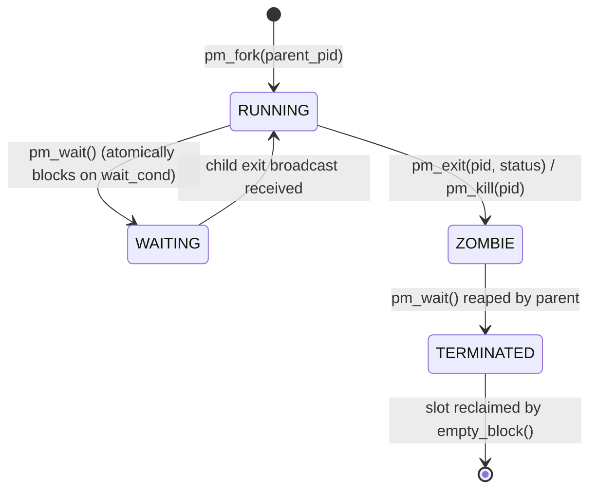
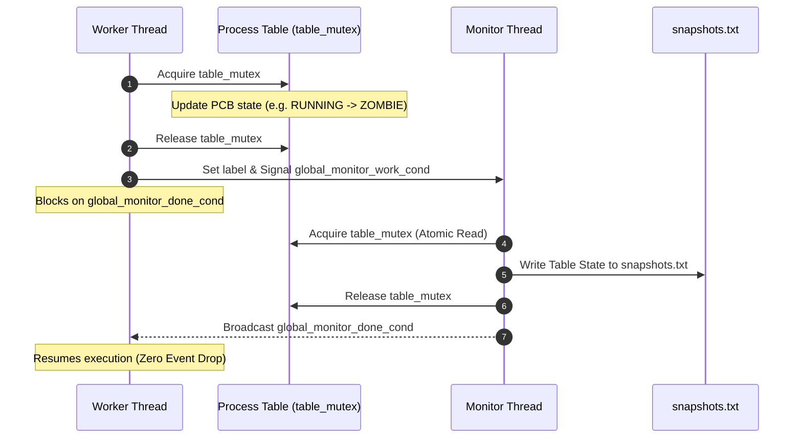

# Multithreaded Operating System Process Manager Simulator

[](https://codespaces.new/tamzidnawfel/os-process-manager-simulator)
[](https://github.com/tamzidnawfel/os-process-manager-simulator/actions)


A high-performance, multithreaded Operating System Process Management Subsystem and Process Control Block (PCB) kernel simulator implemented in **C (C11)** using **POSIX Threads (`pthreads`)**.

---

## ⚡ Quick Start (1-Click Run)

Choose the fastest execution method for your environment:

### 🌐 Option 1: In the Cloud (Recruiters & Reviewers — Zero Install)
Click the badge below to launch a full Linux development container in your web browser via **GitHub Codespaces**. The project compiles and executes the benchmark automatically inside the browser terminal:

[](https://codespaces.new/tamzidnawfel/os-process-manager-simulator)

---

### 💻 Option 2: 1-Click Local Execution (Windows & Linux/macOS)

| Operating System | Command / Action | Highlights |
| :--- | :--- | :--- |
| **Windows** | Double-click **`run.bat`** (or `.\run.bat` in Terminal) | Auto-detects MinGW/MSYS2 GCC, compiles, and opens scenario picker |
| **Linux / macOS** | Run **`./run.sh`** | Auto-detects GCC/Clang, builds with `-Wall -Wextra`, and runs scenario |

---

## 🖥️ Live Terminal Execution & Telemetry Preview

Below is a live verified trace of the kernel simulator executing concurrent worker tasks with ANSI terminal coloring and real-time process state tracking:

```text
================================================================
   Multithreaded OS Process Manager Simulator (1-Click Run)
================================================================
SYSTEM BOOT: Root Process (PID 1) created successfully.
[Thread 1] sleeping 100 ms
[Thread 0] calls pm_fork 1
FORK SUCCESSFUL: Created child PID 2 (Parent: 1)
[Thread 0] sleeping 200 ms
[Thread 1] calls pm_fork 1
FORK SUCCESSFUL: Created child PID 3 (Parent: 1)
[Thread 1] sleeping 300 ms
[Thread 0] calls pm_fork 1
FORK SUCCESSFUL: Created child PID 4 (Parent: 1)
[Thread 0] calls pm_wait 1 -1
WAIT: Parent 1 going to sleep...
[Thread 1] calls pm_exit 2 10
SUCCESSFULLY EXITED: Process 2 is now a ZOMBIE (Status: 10).
WAIT SUCCESSFUL: Parent 1 reaped child 2 (Status: 10).
[Thread 1] calls pm_ps
PID	PPID	STATE		EXIT_STATUS
----------------------------------------------
1	0	RUNNING		-
3	1	RUNNING		-
4	1	RUNNING		-

All worker threads finished.

Final Process Table State:
PID	PPID	STATE		EXIT_STATUS
----------------------------------------------
1	0	RUNNING		-
3	1	RUNNING		-
4	1	RUNNING		-

============================================================
            KERNEL AUDIT & TELEMETRY REPORT
============================================================
Total Processes Created:       4
Active Running Processes:      3
Blocked Waiting Processes:     0
Zombies Remaining (Unreaped):  0
Processes Reaped (Terminated): 1
PCB Capacity Utilization:      4 / 64 slots (6.2%)
Lost Wakeups / Deadlocks:      0 (Atomic condvar synchronization)
============================================================

[OK] Monitor Thread recorded 100% of state changes to snapshots.txt
```

---

## 📌 Architectural Overview

This project simulates the core process scheduling and lifecycle management subsystem of a Unix-like operating system kernel:

1. **Simulated Kernel Space:** Processes are represented by Process Control Blocks (PCBs) managed inside a fixed-capacity global table (`process_table[64]`).
2. **Concurrent Worker Execution:** Multiple worker threads simulate concurrent userland processes and threads executing asynchronous system calls (`fork`, `exit`, `wait`, `kill`, `sleep`, `ps`).
3. **Non-Intrusive Background Observer:** A dedicated background monitor thread captures immutable, atomic snapshots of the global process table into `snapshots.txt` every time a system state transition occurs.

---

## 🏗️ System Architecture & Invariants

### 1. Process Control Block (PCB) Structure
Each process entry maintains strict encapsulation of its state and parent-child linkages:

```c
typedef struct {
    int          pid;                   // Monotonically increasing unique process ID
    int          ppid;                  // Parent process ID (0 for root init process)
    int          exit_status;           // Exit code (-1 while active, >=0 on exit)
    ProcessState state;                 // Current state in 4-state lifecycle
    int          child[MAX_PROCESSES];  // Array tracking child PIDs
    int          num_children;          // Number of direct children
    pthread_cond_t wait_cond;           // Dedicated condition variable for wait synchronization
} PCB;
```

---

### 2. Process Lifecycle & State Machine



- **`RUNNING` (Active):** Initial state assigned to a newly created process upon `pm_fork()`.
- **`WAITING` (Blocked):** Process is blocked waiting for an active child to terminate.
- **`ZOMBIE`:** Process has finished execution, storing its exit status until collected by its parent.
- **`TERMINATED` (Reaped):** Process has been reaped via `pm_wait()`. Inactive slots are recycled dynamically when table capacity is reached.

---

## ⚙️ Concurrency & Synchronization Engineering

The simulator incorporates advanced multithreading principles to eliminate common concurrency pitfalls:



### 1. Atomic Wait/Wakeup Synchronization (`pthread_cond_wait`)
- **The Problem:** In multithreaded kernels, if a parent checks for exited children, releases its lock, and sleeps on a separate lock, a child might exit in that window. The exit signal is sent to an empty wait queue, causing the parent to sleep forever (**Lost Wakeup Race Condition**).
- **The Solution:** In `pm_wait()`, atomic lock transition is guaranteed:
  ```c
  pthread_cond_wait(&process_table[p_index].wait_cond, &table_mutex);
  ```
  The parent atomically releases `table_mutex` and enqueues on `wait_cond`. When any child exits, `pm_exit()` broadcasts on the parent's `wait_cond` while holding `table_mutex`, mathematically eliminating the window for lost wakeups.

### 2. Zero-Loss Rendezvous Monitoring Barrier
- **The Problem:** Traditional polling or version counters drop events if multiple worker threads update the process table faster than the monitor can poll.
- **The Solution:** A two-way condition variable handshake (`global_monitor_work_cond` and `global_monitor_done_cond`) implements a strict rendezvous pattern. The mutating worker hands off control and waits until the monitor thread writes the snapshot to disk before proceeding. This guarantees **100% snapshot capture rate in exact chronological order**.

### 3. Dynamic PCB Slot Reclamation
- When the 64-process table fills up, `empty_block()` prioritizes `STATE_UNUSED` slots first.
- If full, it scans for `STATE_TERMINATED` slots (reaped processes), safely calls `pthread_cond_destroy(&process_table[i].wait_cond)`, and recycles the slot for the incoming process.

---

## 📁 Repository Organization

```text
.
├── .devcontainer/          # GitHub Codespaces browser sandbox configuration
│   └── devcontainer.json
├── .github/                # Automated CI/CD pipeline
│   └── workflows/
│       └── ci.yml          # Dual-compiler build & multi-scenario test suite
├── include/                # Header definitions
│   └── pm_simulator.h      # PCB data structures, states, function prototypes, ANSI macros
├── src/                    # Implementation modules
│   ├── process_manager.c   # Process table lifecycle, condition variables & audit telemetry
│   └── pm_sim.c            # Multithreaded driver, worker threads & monitor observer
├── tests/                  # Curated simulation test suites
│   ├── thread1.txt         # Scenario 1: Standard Benchmark (Worker 0)
│   ├── thread2.txt         # Scenario 1: Standard Benchmark (Worker 1)
│   ├── tree_t0.txt         # Scenario 2: Deep Hierarchy Tree (Root worker)
│   ├── tree_t1.txt         # Scenario 2: Deep Hierarchy Tree (Intermediate worker)
│   ├── tree_t2.txt         # Scenario 2: Deep Hierarchy Tree (Leaf worker)
│   ├── stress_t0.txt       # Scenario 3: High Concurrency (Dual waits)
│   ├── stress_t1.txt       # Scenario 3: High Concurrency (Worker exit)
│   └── stress_t2.txt       # Scenario 3: High Concurrency (Multiple exits)
├── Makefile                # Build orchestration (make test, make tree, make stress)
├── LICENSE                 # MIT Open-Source License
├── run.bat                 # Windows 1-click auto-detecting build & runner
├── run.sh                  # Linux/macOS 1-click build & runner
├── README.md               # Architecture documentation
└── .gitignore              # Build and metadata exclusion rules
```

---

## 🔀 Curated Test Scenarios

The simulator includes 3 pre-configured scenarios selectable directly from `run.bat` or `make`:

| Scenario | Name | Thread Count | Key OS Concepts Demonstrated |
| :---: | :--- | :---: | :--- |
| **1** | **Standard Benchmark** | 2 Threads | Baseline process creation, interleaved sleeps, exit code collection |
| **2** | **Deep Hierarchy Tree** | 3 Threads | Parent $\rightarrow$ Child $\rightarrow$ Grandchildren; multi-level process branching |
| **3** | **High Concurrency Stress** | 3 Threads | Dual concurrent `wait` calls, rapid exit broadcasts, race-free reaping |

---

## 📜 Script Command Grammar

Worker threads parse and execute plain-text scenario instructions:

| Command | Syntax | Description |
| :--- | :--- | :--- |
| **`fork`** | `fork <parent_pid>` | Allocates a child under `parent_pid` and assigns the next unique PID. |
| **`exit`** | `exit <pid> <status>` | Terminates `pid` with exit status code, transitioning it to `ZOMBIE`. |
| **`wait`** | `wait <parent_pid> <child_pid>` | Blocks parent until `child_pid` exits. Pass `-1` to reap any first exited child. |
| **`kill`** | `kill <pid>` | Issues immediate termination with default exit status `9` (`SIGKILL`). |
| **`sleep`** | `sleep <ms>` | Pauses the worker thread for the specified duration in milliseconds. |
| **`ps`** | `ps` | Displays color-coded tabular process table snapshot to standard output. |

---

## 🛠️ Advanced Compilation & Manual Usage

The project builds cleanly under strict compliance flags (`-Wall -Wextra -Werror -pedantic -std=c11`):

```bash
# Compile executable
make all

# Run Scenario 1 (Standard Benchmark)
make test

# Run Scenario 2 (Deep Hierarchy Tree)
make tree

# Run Scenario 3 (High Concurrency Stress Test)
make stress

# Remove build artifacts and snapshots.txt
make clean
```

---

## 🔬 CI/CD Multi-Compiler Verification

Every commit pushed to this repository triggers an automated **GitHub Actions CI workflow** on Ubuntu Linux:
- Compiles with **GCC** using `-Wall -Wextra`
- Executes all 3 test scenarios and verifies `snapshots.txt` integrity
- Recompiles with **Clang** to guarantee multi-compiler compliance

---

## 📜 License
This project is licensed under the **MIT License** — see the [LICENSE](LICENSE) file for details.
